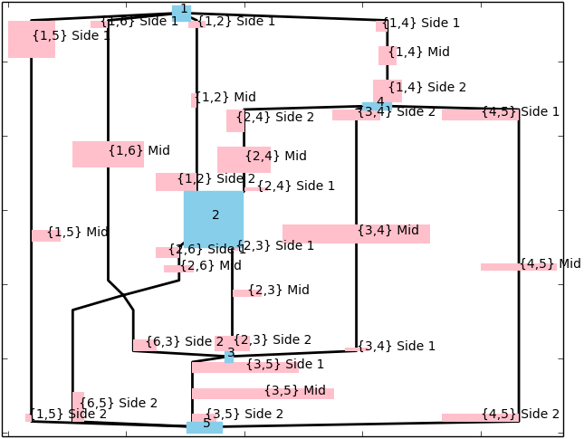
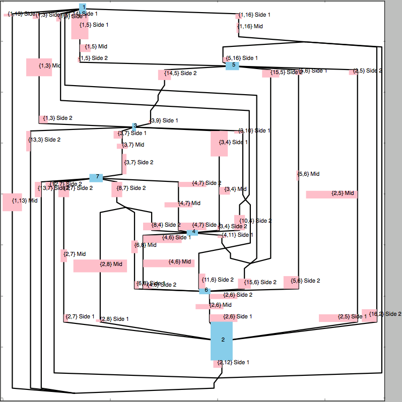
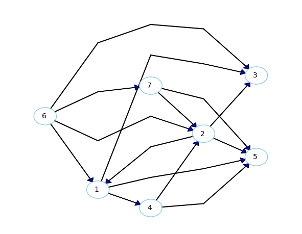

# Wailea

Wailea is a set of command-line tools and a library of basic graph operations
and graph algorithms mainly for drawing both undirected and directed graphs.
It is written in C++14.

# What Is It?

It takes a simple graph as its input, and generates combinatorial and geometric
information required to draw the graph on 2-plane.

For undirected graphs, the inforamtion is given in xy-coordinates for the node
labels, edges, and edge labels in a visibility representation where the nodes
are represented by horizontal line segments and the edges are by vertical ones.

For directed graphs, the information is given in integer xy-coordinates of
nodes.

It comes with a main library and 5 command-line tools as follows.
Each command-line tool takes an input file in a designated format, and generates
the result in text in another format.

* **libs/libwailea.so**

Main library.

* **bin/decomposer**:
[main source file](src_bin/decomposer.cpp)

This takes a simple undirected graph and decomposes it into BC-tree.

* **bin/planarizer**:
[main source file](src_bin/planarizer.cpp)

This takes a biconnected undirected graph and planarize it by inserting virtual
nodes and splitting edges at crossings. The resultant graph is planar, but this
command does not find an embedding.

* **bin/biconnected_embedding_finder**:
[main source file](src_bin/biconnected_embedding_finder.cpp)

This takes a planar biconnected graph and finds a planar embedding of it and
its dual graph with faces and dual edges.

* **bin/vis_rep_finder**:
[main source file](src_bin/vis_rep_finder.cpp)

This takes a BC-tree, planar embeddings for its blocks, information about
how incident faces around each cut vertex are unified, and
rectangular label dimensions for nodes and edges as its input.
It produces a visibility representation of the underlying connected graph in 
the real xy-coordinates for the nodes and edges.

* **bin/digraph_arranger**
[main source file](src_bin/digraph_arranger.cpp)

This takes a single connected directed graph and arranges the nodes in
the integer x/y-coordinates (rank/position).

# Install

## Main command-line tools and the library.
`$ make` or `$make all`

This will get you the library and 5 command-line tools.

## Sample Drawers

It comes with two sample drawers.
Those are quick-and-dirty python scripts originally written to test libwailea.
Sample drawings with their corresponding input files are shown below in this 
file.

* [**util/sample_graph_drawer.py**](util/sample_graph_drawer.py)

This internally calls `decomposer`, `planarizer`, 
`biconnected_embedding_finder`, and `vis_rep_finder`.

* [**util/sample_digraph_drawer.py**](util/sample_digraph_drawer.py)

This internally calls `digraph_arranger`.

## Unit Tests

`$ make unit_tests undirected`

`$ make unit_tests directed`

These commands will run unit tests using Google Test.
Update `GOOGLE_TEST_INC_DIR` and `GOOGLE_TEST_LIB_DIR` in [Makefile](Makefile)
 according to your environment.

# Requirements
Wailea should work on any platform that supports C++14.
However, I have tested it only on the following environment.
  - Macbook Pro (Intel Corei5) macOS Sierra 10.12.6

If you want to run the sample drawers, you will need Python, numpy, 
and matplotlib.

# License
Copyright (c) 2017 Shoichiro Yamanishi

Wailea is released under MIT license. See `LICENSE` for details.

# Contact
For any inquiries, please contact:
Shoichiro Yamanishi

yamanishi72@gmail.com

# Sample drawings

Some drawings by the sample drawers and their corresponding input files 
are shown below.

[Input file](samples/sample_original_input_05.txt)

[Input file](samples/sample_original_input_03.txt)

[Input file](samples/sample_original_input_04.txt)

[Input file](samples/digraph_arranger_test_01.txt)

[Input file](samples/digraph_arranger_test_02.txt)

[Input file](samples/digraph_arranger_test_03.txt)

# Design goals

* __Portability__ :
No dependencies except for standard libraries. Based on C++ 14.
Implementing graph algorithms will involve complex data structures with
lots of interlinks.
Most of the modern C++ textbooks strongly discourage the use of raw pointers.
However, my experiment showed significant overhead when `unique_ptr<>`, 
`shared_ptr<>1, and `weak_ptr<>` are used.
As a compromise, the linkage are implemented in iterators of standard
containers, with `dynamic_cast<>` as a runtime safeguard mechanism.

* __Reliability__ :
Unit tested with Google Test. 100,000 lines of test codes. 670 Test cases.
26700 EXPECT_* checks. No recursive calls at runtime.

* __Usability__ :
Released under MIT licence.

# Milestones and future plans.

* *May 2016* Development starts

* *Apr 2017* Undirected algorithms converge

* *Jun 2017* Directed algorithms converge

* *Oct 2017* Alpha release

* *TODO* Documentation

# How does it do it?

## Undirected Graph
Wailea employes the edge-insersion paradigm.
The input graph G is assumed to be simple.
a DFS algorithm decomposes G into connected components.
For each connected component Gc, a DFS algorithm by Hopcroft and Tarjan (1973)
decomposes it into a BC-tree.
For each biconnected component Gb in the BC-tree, Wailea finds a planar 
spanning subgraph Gp and a set of complementary removed edges Er.
A DFS algorithm by Tarjan [T85] first finds an st-ordering of the nodes in Gp,
or N(Gp).
Then the 1st phase of PQ-tree planarization algorithm [JTS89] finds the first
version of Gp and Er. Gp at this stage may not be maximally planar.
If Gp is still biconnected, then Wailea recalculates an st-ordering and then it
tries to insert each edge e in Er to Gp to make Gp maximally planar. [BL76] is
used to test the planarity of Gp + {e}.

Then, for each {u,v} in Er, the edge-insersion algorithm [GMW05] inserts {u,v}
into Gp. This is a very complex process involving the following algorithms.

* BC-tree decomposition
* SPQR-tree decomposition
* Path finder on a tree
* Planar embedding finder
* Dual graph finder
* Shortest path finder

The basic idea is explained in [GMW05] and the implementation details are in
the comments in
[gmw_edge_inserter.hpp](include/undirected/gmw_edge_inserter.hpp).

At this stage, each Gb has been planarized.
[BL76] finds a planar embedding of Gb and its dual.
Then Wailea creates something called embedded BC-tree.
It contains the planar embedding (and its dual) of each block as well as
how the incident faces around each cut vertex will be unified.
The details are found in
[embedded_bctree.hpp](include/undirected/embedded_bctree.hpp).

Then Wailea finds a visibility representation of Gc based on the information
in the embedded BC-tree. The process is basically a recursive application
of traditional visibility representaion for blocks. It also considers the
node and edge labels. The node labels are centered at each node, and
there are three types of edge labels: near node 1, in the middle of edge, and
near node 2. And there are three types of edge label placement: center of
the edge curve, touching the curve on CCW side, 
and touching the curve on CW side. The details are found in 
[vis_rep_finder.hpp](include/undirected/vis_rep_finder.hpp).

Finally for each Gc, we have a visibility representation in the xy-coordinates
of the nodes, edges, node labels, and edge labels.
The nodes are drawn as horizontal line segments with sufficient thickness to
place the node label at their center. The area for each face is calculated
such that the incident labels are places with sufficient margin.
The edge curves are drawn as vertical line segments along those faces.

## Directed Graph
Wailea basically follows the subset of the steps as GraphViz's dot takes [GKNV]
with its original twist.
It's usually called heiearchical or Sugiyama drawing.

The first step is to make the digraph acyclic by flipping some of the edges.
The next step is to assign ranks to each node.
The third step is to reduce crossings between two adjacent ranks.
GraphViz then assigns coordinates to vertex labels using network simplex, and
then draws polynomial curves along the series of adjacent rectangular areas,
but Wailea does not do them (yet). It generates the rank and position of each
node as kind of integer coordinates and stops.

To make the graph acyclic Wailea takes the following steps.

1. Assign cyclic ranks to each node by network simplex such that the sum of
   (edge length * edge cost) is minimized. This can be considered a PO set
   on the nodes.

2. Serialize the cyclic ranks by breaking the ties at the same rank based on
   their in- and out-degrees of the nodes on the rank. This can be considered
   a cyclic total order.

3. Break the cycle at the gap between two ranks that has the minimum total
   edge cost. This makes the desired acyclic order and the edges against
   the order will be flipped to make the graph acyclic.

This problem of making a graph acyclic is called FAS (feedback arc set) 
problemand known to be NP-hard, and usually some heuristics are taken to make
the graph acyclic.
I think this approach presented above is amenable to declarative drawings, as
it considers the edge cost.
The details are given in
[acyclic_ordering_finder.hpp](include/directed/acyclic_ordering_finder.hpp).

The next step is the rank assignment. It is done by network simplex.
GraphViz solves this problem in the dual space, but Wailea does it in the
primary space for both phase I and II, where phase I finds the initial
feasible soluion and then phase II optimizes it.
The details are given in
[network_simplex.hpp](include/directed/network_simplex.hpp).

The final step is crossing reduction. This is again known to be NP-hard.
Wailea follows the same approach as GraphViz, called barycenter heuristics
with transposes. The details are given in [GKNV].

    
# List of Main Algorithms
The following is the list of main algorithms implemented in libwailea.

## Undirected Graph

* **ConnectedDecomposer**
[connected_decomposer.hpp](include/undirected/connected_decomposer.hpp) :
Decomposes a given graph into connected components in DFS.

* **BiconnectedDecomposer**
[bctree.hpp](include/undirected/bctree.hpp) :
Decomposes a given connected graph into BC-tree in DFS [RND77].

* **SPQRDecomposer**
[spqr_decomposer.hpp](include/undirected/spqr_decomposer.hpp) :
Decomposes a given biconnected graph into SPQR-tree in DFS.
The original algorithm is proposed by [HT73], and then later it is corrected
by [GM01]. It is still hard to understand and [I have arranged a supplementary
document here](docs/spqr_explained/HTGMExplained.pdf)

* **STNumbering** (undirected/st_numbering.hpp) :
[st_numbering.hpp](include/undirected/st_numbering.hpp) :
Generates an ST-ordering for a biconnected graph in DFS [T85].

* **JTSPlanarizer**
[jts_planarizer.hpp](include/undirected/jts_planarizer.hpp) :
Classifies the edges of a given biconnected graph into a good planar subgraph
and a set of removed edges. The first phase of [JTS89], which finds a planar 
spanning subgraph. The claimed maximality was refuted by manu, but I think
the 1st phase is still useful to find a base planar graph and in many cases
the subgraph is biconnected.

* **BLPlanarityTester**
[bl_planarity_tester.hpp](include/undirected/bl_planarity_tester.hpp) :
Tests if a given biconnected graph is planar, and finds a combinatorial planar
embedding of a given planar biconnected graph. [BL76]
I believe the original [BL76] is incorrect as it is incapable of handling 
certain arrangement of pertinent frontiers. This may be the only correct
implementation of PQ-tree planarity algorithm available so far.

* **PlanarDualGraphMaker**
[planar_dual_graph_maker.hpp](include/undirected/planar_dual_graph_maker.hpp) :
Makes a dual graph structure of the given planar biconnected graph in a palanr
embedding. My own linear time algorhitm as I could not find any in public.

* **GMWEdgeInserter**
[gmw_edge_inserter.hpp](include/undirected/gmw_edge_inserter.hpp) :
Inserts an edge into a given connected graph such that the number of crossings
is minimized [GMW05].

* **EmbeddedBCTree** (undirected/embedded_bctree.hpp) :
[embedded_bctree.hpp](include/undirected/embedded_bctree.hpp) :
Represents an embedding of a connected graph decomposed into a BC-tree.
My own algorithm.

* **VisRepFinder**
[vis_rep_finder.hpp](include/undirected/vis_rep_finder.hpp) :
Generates a visibility representation of a connected graph.
My own algorithm based on [TT86]. It handles not only biconnected graphs,
but also connected graphs.

## Directed Graph
* **AcyclicOrderingFinder**
[acyclic_ordering_finder.hpp](include/directed/acyclic_ordering_finder.hpp) :
Finds an acyclic ordering of a given graph that may contain cycles.
My own algorithm using network simplex as described above.

* **NetworkSimplex**
[network_simplex.hpp](include/directed/network_simplex.hpp) :
Solves the network simplex problem, which is a variant of integer linear
programming. Both phase I and II are solved in the primary space.
The phase I solves an aux problem to find an initial feasible solution, and
the phase II takes it to an optimum.
Used by AcyclicOrderingFinder and GKNV rank assignment in SugiyamaDiGraph.

* **GKNVcrossingsReducer**
[gknv_crossings_reducer.hpp](include/directed/gknv_crossings_reducer.hpp)
Tries to reduce the crossings in a connected bipartite digraph in a embedding
with a barycenter and adjacent transpose heuristics.
Employed in dot of GrpahViz. A bit crude but it gives pretty good results.

* **SugiyamaDiGraph**
[sugiyama_digraph.hpp](include/directed/sugiyama_digraph.hpp)
Finds integer xy-coordinates of the nodes of the given digraph in Sugiyama
heiearchical framework. 

# References

* [BL76]
"Testing for the consecutive ones property, interval graphs, 
and graph planarity using PQ-tree algorithms",
Kellogg S. Booth & George S. Lueker
Journal of Computer and System Sciences archive Volume 13 Issue 3, 
December, 1976 Pages 335-379 Academic Press, Inc. Orlando, FL, USA

* [GKNV]
"A technique for drawing directed graphs." ,
E. R. Gansner, E. Koutsofios, S. C. North, and K. P Vo. 
IEEE Transactions on Software Engineering, 19(3):214–230, March 1993.

* [GMW05]
"Inserting an Edge into a Planar Graph",
Carsten Gutwenger, Petra Mutzel, Rene Weiskircher 
Algorithmica 41(4):289-308, April 2005

* [GM01]
"A linear time implementation of SPQR trees",
Gutwenger, Carsten &  Mutzel Petra, 
Proc. 8th International Symposium on Graph Drawing (GD 2000),
Lecture Nodes in Computer Science 1984, Springer-Verlag, pp. 77-90,
doi:10.1007/3-540-44541-2_8

* [HT73]
"Dividing a graph into triconnected components",
Hopcroft, John & Tarjan, Robert (1973), 
 SIAM Journal on Computing 2 (3): 135-158, doi:10.1137/0202012

* [JTS89]
"O(n2) Algorithms for Graph Planarization",
R. Jayakumar, K. Thulasiraman, M.N.S. Swamy,
IEEE Transactions on Computer-aided Design, Vol 8. No. 3, March 1989

* [RND77] 
"Combinatorial Algorithms Theory and Practice",
E.M. Reingold, J Nievergelt, & N Deo,
Prentice Hall (Dec. 1977) 978-0131524477
(Biconnected decomposition algorithm is found at
https://www.cs.cmu.edu/~avrim/451f12/lectures/biconnected.pdf )

* [TT86]
"A Unified Approach to Visibility Representation of Planar Graphs",
R. Tamassia and I.G. Tollis, 
Discrete Comput Geom 1:321-341 (1986)

* [T85]
"Two Streamlined Depth-First Search Algorthms",
Robert Endre Tarjan
Computer Science Department Princeton University Princeton, 
NJ 08544 and AT&T Bell
Laboratories Murray Hill, NJ 07974 July, 1985 CS-TR-013-86
ftp://ftp.cs.princeton.edu/techreports/1985/013.pdf

